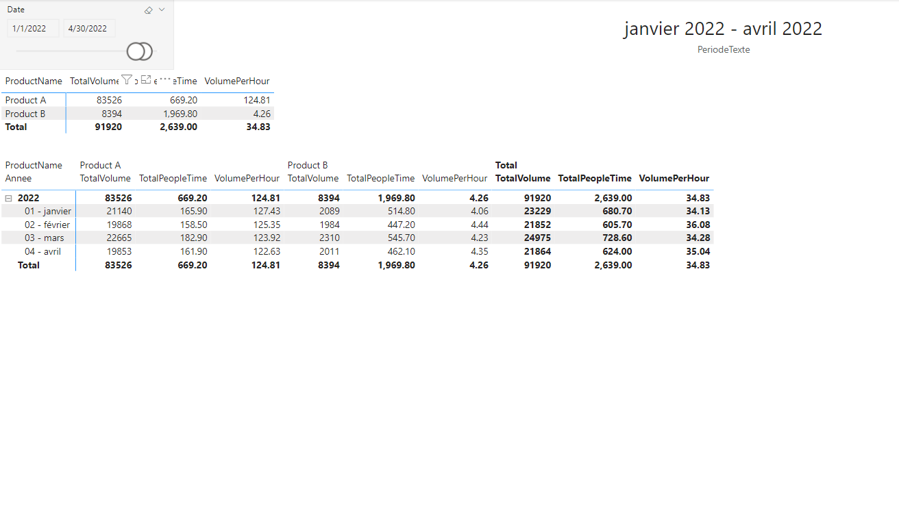

# Summary

Calculation Groups in Power BI are a very effective way to reduce the number of measures in your data model. This concept also means less time to do more, even though Calculation Groups can be difficult to master and implement, especially when you combine them. This cookbook is written as a reminder to accelerate the implementation of Calculation Groups in your Power BI Datasets and Reports.

To implement calculation group, you need the **[tabular editor](https://tabulareditor.com/)** external tool.
To write this article, the [free version](https://tabulareditor.github.io/) has been used. You can download it following this [link](https://github.com/TabularEditor/TabularEditor/releases).

In this article, the following [Power BI file](./CalculationGroup-0-Startup.pbix) will be completed step-by-step. It contains a *Calendar dimension* ([see](../DateDimension/README.md)) and basic data about productivity, per date and per product:

- people time,
- manufactured volume.

Three measures are defined:

- ***TotalPeopleTime***,
- ***TotalVolume***,
- ***VolumePerHour*** = *TotalVolume* / *TotalPeopleTime*.



> The [data file](./Resources/productivityData-20190101-20220518.csv) was generated using [this tool](https://github.com/EhRom/DataGenerator).

## Level 1: first Calculation Group

Often, people want to compare KPIs with the KPIs of the last year. They also need to measure the delta, both in value and percentage.

To do this, **9** regular measures must be created:

- The last year measures (3),
- The difference in value  (3),
- The difference in percentage (3)

With calculation group, the three base measure are sufficient !

1. Open tabular editor from the Power BI report on Power BI Desktop:

    

1. Expand *Tables*. Right click on *Tables*, choose *Create New* and the *Calculation Group*:

    

1. Name the calculation group (***CalendarIntelligence***):

    

1. Set the name of the main field of the calculation group as *Period*:

    

1. Right click on *Calulation Items*, and choose *New Calulation Item*:

    

1. Name the itme (*N*), set the ordinal at *0*, set the expression at `SELECTEDMEASURE()` and the *Format String Expression* at `SELECTEDMEASUREFORMATSTRING()`

    

    In a visual, it will display a *selected measure* in the same format as the original measure.

1. Create a new calulation item, named *N-1*, with the ordinal at *1*. Set the expression at `CALCULATE(SELECTEDMEASURE(), SAMEPERIODLASTYEAR(Calendrier[Date]))` and the *Format String Expression* at `SELECTEDMEASUREFORMATSTRING()`

    

    This calculates the value of a selected measure on the same period, the year before.

1. Create a third calulation item, named *~*, with the ordinal at *2*. Set the *Format String Expression* at `SELECTEDMEASUREFORMATSTRING()` and the the expression at:

    ```dax
    IF(ISBLANK(CALCULATE(SELECTEDMEASURE(), CalendarIntelligence[Period] = "N")) ||
        ISBLANK(CALCULATE(SELECTEDMEASURE(), CalendarIntelligence[Period] = "N-1")),
                BLANK(),
            CALCULATE(SELECTEDMEASURE(), CalendarIntelligence[Period] = "N") -
            CALCULATE(SELECTEDMEASURE(), CalendarIntelligence[Period] = "N-1")
    )
    ```

    or the optimized query:

    ```dax
    VAR currentYearValue = CALCULATE(SELECTEDMEASURE(), CalendarIntelligence[Period] = "N")
    VAR previousYearValue = CALCULATE(SELECTEDMEASURE(), CalendarIntelligence[Period] = "N-1")

    VAR difference = IF(ISBLANK(currentYearValue) || ISBLANK(previousYearValue), BLANK(),
        currentYearValue - previousYearValue
    )

    RETURN
        difference
    ```

    

    This is the difference between the value of a selected measure, and its value over the same period in the previous year. The ordinal value is important, because this measure must be calculated **after** the first two.

1. Create a fourth calulation item, named *%*, with the ordinal at *3*. Set the *Format String Expression* at `"0.00%"` and the the expression at:

    ```dax
    IF(CALCULATE(SELECTEDMEASURE(), CalendarIntelligence[Period] = "~") = BLANK(),
        BLANK(),
        DIVIDE(
            CALCULATE(SELECTEDMEASURE(), CalendarIntelligence[Period] = "~"), 
            CALCULATE(SELECTEDMEASURE(), CalendarIntelligence[Period] = "N-1"), BLANK())
    )
    ```

    or the optimized query:

    ```dax
    VAR difference = CALCULATE(SELECTEDMEASURE(), CalendarIntelligence[Period] = "~")

    VAR previousYearValue = CALCULATE(SELECTEDMEASURE(), CalendarIntelligence[Period] = "N-1")

    VAR evolution = IF(ISBLANK(difference), BLANK(),
        DIVIDE(difference, previousYearValue, BLANK())
    )

    RETURN
        evolution
    ```

    This is the ratio of a selected measure over the same period in the previous year. The ordinal value is important, because this measure must be calculated **after** the first three.

    

1. Save and persist the calculation group in Tabular Editor:

    

1. In Power BI, duplicate the first page. In the matrix, add the *Period* field from the new *CalendarIntelligence* table:

    

1. The calculation group can also be used in graphics, for example to display the current year, and the previous one, or only the variation on percentage. You need to add the *Period*, from the *CalendarIntelligence* table, in the legend of the visual, and add a filter on the *Period* and select for example *N* and *N-1* or "%":

    

1. Here is the final result:

    

## Level 2: cumulative period

Sometimes, with a single click and on the same page, people may need to switch between a specific month and the year-to-date.

> under construction: in the next episode, we will see how to do it with no new measure and a calculation group \o/

## Level 3: use of several measure units

> under construction (but need a new dataset 😉)

## Sources

To discover the concept of Calculation Groups, I encourage you to see the following videos and read the following blog posts:

- Video (in French): [Club Power BI Lille - Les Calculation Group et OLS](https://youtu.be/0AZyjE2syus?t=1008)
- Video: [REDUCE the # of measures with Calculation Groups In Power BI](https://youtu.be/vlnx7QUVYME)
- Series of blog post: [Calculation Groups](https://www.sqlbi.com/calculation-groups/)
- Blog post: [Understanding Calculation Groups](https://www.sqlbi.com/articles/understanding-calculation-groups/)
- Blog post: [Using calculation groups to selectively replace measures in DAX expressions](https://www.sqlbi.com/articles/using-calculation-groups-to-selectively-replace-measures-in-dax-expressions/)
