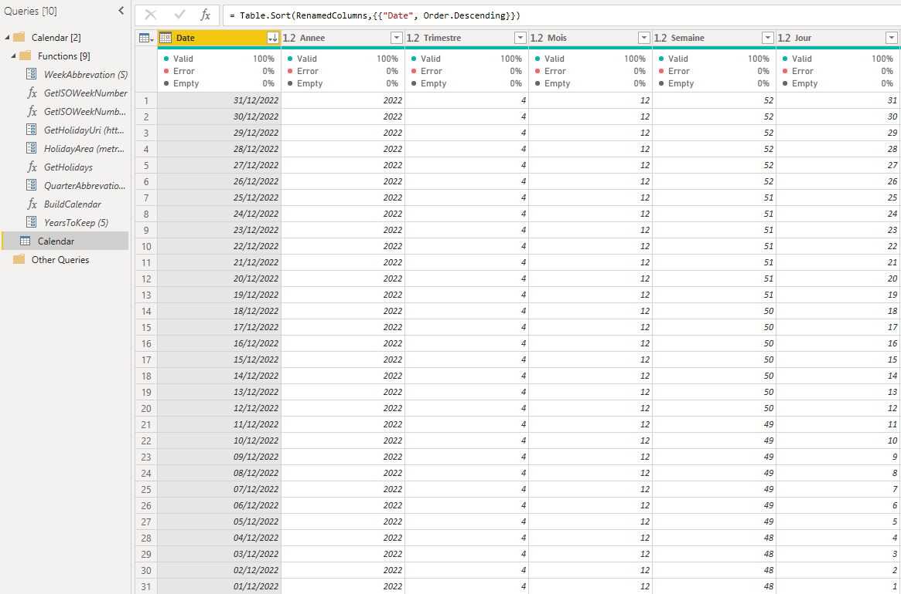
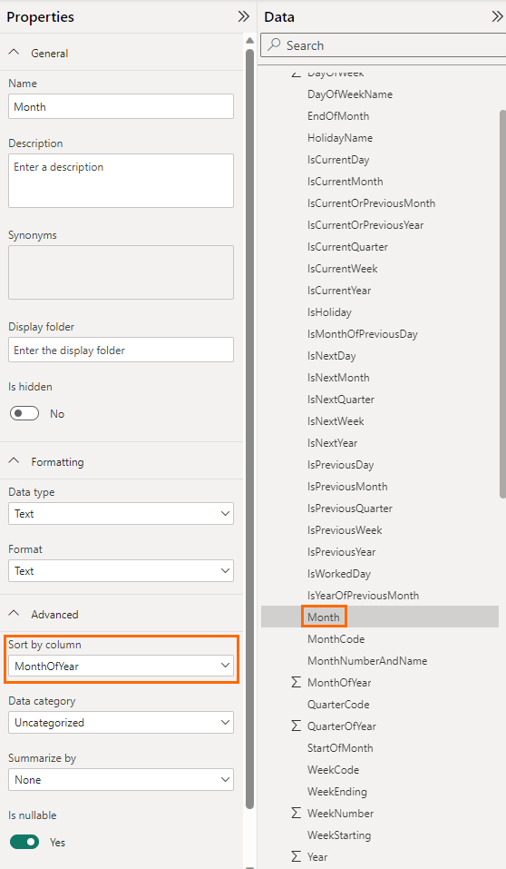
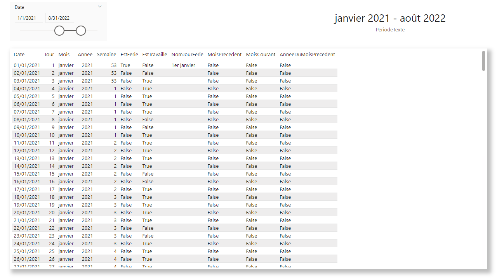
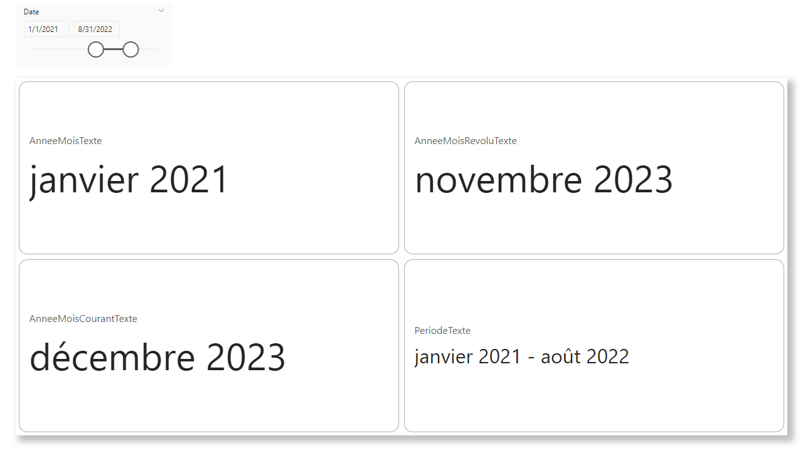
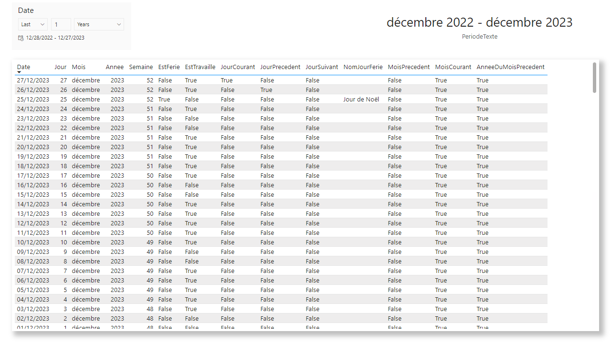
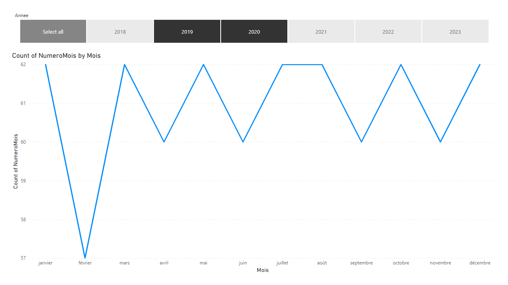

# Summary

In this article, a calandar for data analysis in Power BI will be built, using the Power Query (M) language.
The calandar is built dynamically: each time the dataset is refreshed, the calendar dimension is updated, and based on the current date.

Week numbers are calculated the ISO convetion.

The french holidays are also included, using an open dataset provided the French governement open data initiative.

# ISO Week Number

## **GetISOWeekNumber** function

The ISO week numbers (definition on [Wikipedia](https://en.wikipedia.org/wiki/ISO_week_date#Calculating_the_week_number_of_a_given_date)) are calculated with a function defined in M language (Power Query) and named **GetISOWeekNumber**:

``` powerquery
let
    ISOWeekNumber = (DateToProcess as date) as number =>
  let
    BaseWeekNumber = Number.RoundDown((Date.DayOfYear(DateToProcess) - Date.DayOfWeek(DateToProcess, Day.Monday) + 9) / 7),
    ISOWeekNumber = if BaseWeekNumber = 0
                  then Number.RoundDown((Date.DayOfYear(#date(Date.Year(DateToProcess) - 1, 12, 31)) - Date.DayOfWeek(#date(Date.Year(DateToProcess) - 1, 12, 31), Day.Monday) + 9) / 7)
              else if BaseWeekNumber = 53 and Date.DayOfWeek(#date(Date.Year(DateToProcess), 12, 31), Day.Monday) + 1 < 4
                  then 1
              else BaseWeekNumber
  in
    ISOWeekNumber
in
    ISOWeekNumber
```

> Source : [How to calculate ISO week number in Power Query](https://datacornering.com/how-to-calculate-iso-week-number-in-power-query/)

## **WeekAbbrevation** parameter

To handle culture, a parameter is required **WeekAbbrevation**, and defined as follow:
It is a list of **text** values:
- W (*week*) for English language,
- S (*semaine*) for French language

> Source : [How to calculate ISO year in Power Query](https://datacornering.com/how-to-calculate-iso-year-in-power-query/)

## **GetISOWeekNumberWithYear** function

The ISO code week (concatenation of the ISO year and the ISO week number) is also calculated with a M function and named **GetISOWeekNumberWithYear**:

``` powerquery
let
    ISOWeekNumber = (DateToProcess as date) as text =>
  let
    ISOWeekNumber = GetISOWeekNumber(DateToProcess),
    ISOYear = Date.Year(Date.AddDays(DateToProcess, 26 - ISOWeekNumber)),
    ISOWeekNumberWithYear = Text.From(ISOYear) & " " & WeekAbbrevation & (if ISOWeekNumber < 10 then "0" else "") & Text.From(ISOWeekNumber)
  in
    ISOWeekNumberWithYear
in
    ISOWeekNumber
```

# Holidays

The French holiday data are retrieved from the following open data [page / service](https://calendrier.api.gouv.fr/jours-feries/).

The holidays are retrieved with a function named **GetHolidays**. The function takes the year as argument (or no argument to retrieve the French holidays from 2000 to 2025).

## Paramters

The function is based on two paramters:
- **GetHolidayUri**, of type text > value: `https://calendrier.api.gouv.fr/jours-feries/`
- **HolidayArea**, of type text > value: `metropole`

## **GetHolidays** function

**GetHolidays** function definition:

``` powerquery
let
    WorkedDayList = (optional year as number) as table =>
  let
    RelativePathUri = HolidayArea & (if year = null then "" else "/" & Text.From(year)) & ".json",
    Source = Json.Document(Web.Contents(GetHolidayUri,
      [
        RelativePath=RelativePathUri
      ])),
    ConvertToTable = Record.ToTable(Source),
    ChangeType = Table.TransformColumnTypes(ConvertToTable,{{"Name", type date}, {"Value", type text}}),
    RenameColumns = Table.RenameColumns(ChangeType,{{"Name", "HolidayDate"}, {"Value", "HolidayName"}})
  in
    RenameColumns
in
    WorkedDayList
```

# Calendar

## Paramters

To handle culture, a parameter is required **QuarterAbbrevation**, and defined as follow:
It is a list of **text** values:
- Q (*quarter*) for English language,
- T (*trimestre*) for French language

## **BuildCalendar** function

The function **BuildCalendar** is used to generate the calendar. The definition of the function is available below. The following fieds are calculated:

|Field|Description|Data Type|
|---|---|---|
|**Date**|Date / *current date*.|Date|
|**Year**|Year of the date.|Number|
|**QuarterOfYear**|Quarter of the date.|Number|
|**MonthOfYear**|Month number of the date.|Number|
|**DayOfMonth**|Day of the month.|Number|
|**Month**|Name of the month.|Text|
|**MonthNumberAndName**|Month number and month name of the date (for ordering purpose).|Text|
|**DayOfWeekName**|Name of the day in the week.|Text|
|**DayOfWeek**|Day number of the week.|Number|
|**WeekStarting**|Start date of the week corresponding to the current date.|Date|
|**WeekEnding**|End date of the week corresponding to the current date.|Date|
|**MonthCode**|Code of the month, including the year. E.g. 202311, for November 2023.|Text|
|**QuarterCode**|Code of the quarter, including the year and the quarter character abbreviation (cf. the parameter defined above). E.g. 2023 Q3, for the third quarter of 2023.|Text|
|**StartOfMonth**|Start date of the month corresponding to the current date.|Date|
|**EndOfMonth**|End date of the month corresponding to the current date.|Date|
|**IsHoliday**|Defines whether the current date is a public holiday.|Logical|
|**HolidayName**|Name of the public holiday, if the current date is a public holiday.|Text|
|**IsWorkedDay**|Defines whether the current date is a worked day.|Logical|
|**WeekNumber**|(ISO) Week number of the date.|Number|
|**WeekCode**|Code of the (ISO) week number, including the year and the week character abbreviation (cf. the parameter defined above). E.g. 2023 - W44, for the forty-fouth week of 2023.|Text|
|**IsCurrentYear**|Defines whether the current date is in the current year.|Logical|
|**IsCurrentQuarter**|Defines whether the current date is in the current quarter.|Logical|
|**IsCurrentMonth**|Defines whether the current date is in the current month.|Logical|
|**IsCurrentWeek**|Defines whether the current date is in the current week.|Logical|
|**IsCurrentDay**|Defines whether the current date is today.|Logical|
|**IsNextYear**|Defines whether the current date is in the next year.|Logical|
|**IsNextQuarter**|Defines whether the current date is in the next quarter.|Logical|
|**IsNextMonth**|Defines whether the current date is in the next month.|Logical|
|**IsNextWeek**|Defines whether the current date is in the next week.|Logical|
|**IsNextDay**|Defines whether the current date is tomorrow.|Logical|
|**IsPreviousYear**|Defines whether the current date is in the last year.|Logical|
|**IsPreviousQuarter**|Defines whether the current date is in the last quarter.|Logical|
|**IsPreviousMonth**|Defines whether the current date is in the last month.|Logical|
|**IsPreviousWeek**|Defines whether the current date is in the last week.|Logical|
|**IsPreviousDay**|Defines whether the current date isyesterday.|Logical|
|**IsCurrentOrPreviousYear**|Defines whether the current date is in the current or last year.|Logical|
|**IsCurrentOrPreviousMonth**|Defines whether the current date is in the current or last month.|Logical|
|**IsYearOfPreviousMonth**|Defines whether the current date is in the same year of the previous month.|Logical|
|**IsMonthOfPreviousDay**|Defines whether the current date is in the same month as yesterday.|Logical|

Query definition:

``` powerquery
let
    Calendar = (StartDate as date, EndDate as date, optional Culture as nullable text) as table =>
    let
        DayCount = Duration.Days(Duration.From(EndDate - StartDate)),
        Source = List.Dates(StartDate, DayCount, #duration(1,0,0,0)),
        BuiltTableFromList = Table.FromList(Source, Splitter.SplitByNothing()),
        ChangedType = Table.TransformColumnTypes(BuiltTableFromList,{{"Column1", type date}}),
        RenamedColumns = Table.RenameColumns(ChangedType,{{"Column1", "Date"}}),
        InsertedYear = Table.AddColumn(RenamedColumns, "Year", each Date.Year([Date]), Int64.Type),
        InsertedQuarter = Table.AddColumn(InsertedYear, "QuarterOfYear", each Date.QuarterOfYear([Date]), Int64.Type),
        InsertedMonthOfYear = Table.AddColumn(InsertedQuarter, "MonthOfYear", each Date.Month([Date]), Int64.Type),
        InsertedISOWeekNumber = Table.AddColumn(InsertedMonthOfYear, "WeekNumber", each GetISOWeekNumber([Date]), Int64.Type),
        InsertedDay = Table.AddColumn(InsertedISOWeekNumber, "DayOfMonth", each Date.Day([Date]), Int64.Type),
        InsertedDayWeek = Table.AddColumn(InsertedDay, "DayOfWeek", each Date.DayOfWeek([Date], Day.Monday) + 1, Int64.Type),
        InsertedQuarterCode = Table.AddColumn(InsertedDayWeek, "QuarterCode",  each Number.ToText([Year]) & " " & QuarterAbbrevation & Number.ToText([QuarterOfYear]), type text),
        InsertedMonth = Table.AddColumn(InsertedQuarterCode, "Month", each Date.ToText([Date], "MMMM", Culture), type text),
        InsertedMonthNumberAndName = Table.AddColumn(InsertedMonth, "MonthNumberAndName", each (if Text.Length(Text.From(Date.Month([Date]))) = 1 then "0" else "") & Text.From(Date.Month([Date])) & " - " & Date.ToText([Date], "MMMM", Culture), type text),
        InsertedMonthCode = Table.AddColumn(InsertedMonthNumberAndName, "MonthCode", each Text.From([Year] * 100 + [MonthOfYear]), type text),
        InsertedWeekCode = Table.AddColumn(InsertedMonthCode, "WeekCode",  each GetISOWeekNumberWithYear([Date]), type text),
        InsertedDayOfWeekName = Table.AddColumn(InsertedWeekCode, "DayOfWeekName", each Date.ToText([Date], "dddd", Culture), type text),
        InsertedStartOfMonth = Table.AddColumn(InsertedDayOfWeekName, "StartOfMonth",  each Date.StartOfMonth([Date]), type date),
        InsertedEndOfMonth = Table.AddColumn(InsertedStartOfMonth, "EndOfMonth",  each Date.EndOfMonth([Date]), type date),
        InsertedWeekStarting = Table.AddColumn(InsertedEndOfMonth, "WeekStarting", each Date.StartOfWeek([Date]), type date),
        InsertedWeekEnding = Table.AddColumn(InsertedWeekStarting, "WeekEnding", each Date.EndOfWeek([Date]), type date),
        
        BuiltYearsTable = Table.Distinct(Table.Buffer(Table.SelectColumns(InsertedYear, {"Year"}))),
        BuiltBaseHolidaysTable = Table.AddColumn(BuiltYearsTable, "Holidays", each GetHolidays([Year])),
        JoinedHolidaysTable = Table.ExpandTableColumn(BuiltBaseHolidaysTable, "Holidays", {"HolidayDate", "HolidayName"}),
        ChangedHolidayNameType = Table.TransformColumnTypes(JoinedHolidaysTable,{{"HolidayName", type text}}),
        BuiltHolidaysTable = Table.RemoveColumns(ChangedHolidayNameType, {"Year"}),
        InsertedHolidays = Table.Join(InsertedWeekEnding, "Date", BuiltHolidaysTable, "HolidayDate", JoinKind.LeftOuter),
        InsertedIsHoliday = Table.AddColumn(InsertedHolidays, "IsHoliday", each if [HolidayDate] = null then false else true, type logical),
        InsertedIsWorkedDay = Table.AddColumn(InsertedIsHoliday, "IsWorkedDay", each if [IsHoliday] = true or [DayOfWeek] = 5 or [DayOfWeek] = 6  then false else true, type logical),

        InsertedCurrentDate = Table.AddColumn(InsertedIsWorkedDay, "CurrentDate", each DateTime.Date(DateTime.LocalNow()), type date),
        InsertedYearOfPreviousMonth = Table.AddColumn(InsertedCurrentDate, "YearOfPreviousMonth", each if Date.Month([CurrentDate]) = 1 then Date.Year([CurrentDate]) - 1 else Date.Year([CurrentDate]), Int64.Type),
        InsertedMonthOfPreviousDay = Table.AddColumn(InsertedYearOfPreviousMonth, "MonthOfPreviousDay", each if Date.Day([CurrentDate]) = 1 then (if Date.Month([CurrentDate]) = 1 then 12 else Date.Month([CurrentDate]) - 1) else Date.Month([CurrentDate]), Int64.Type),
        InsertedYearOfPreviousDay = Table.AddColumn(InsertedMonthOfPreviousDay, "YearOfPreviousDay", each if Date.Day([CurrentDate]) = 1 and Date.Month([CurrentDate]) = 1 then Date.Year([CurrentDate]) - 1 else Date.Year([CurrentDate]), Int64.Type),
        
        InsertedIsCurrentYear = Table.AddColumn(InsertedYearOfPreviousDay, "IsCurrentYear", each if Date.IsInCurrentYear([Date]) then true else false, type logical),
        InsertedIsCurrentQuarter = Table.AddColumn(InsertedIsCurrentYear, "IsCurrentQuarter", each if Date.IsInCurrentQuarter([Date]) then true else false, type logical),
        InsertedIsCurrentMonth = Table.AddColumn(InsertedIsCurrentQuarter, "IsCurrentMonth", each if Date.IsInCurrentMonth([Date]) then true else false, type logical),
        InsertedIsCurrentWeek = Table.AddColumn(InsertedIsCurrentMonth, "IsCurrentWeek", each if Date.IsInCurrentWeek([Date]) then true else false, type logical),
        InsertedIsCurrentDay = Table.AddColumn(InsertedIsCurrentWeek, "IsCurrentDay", each if Date.IsInCurrentDay([Date]) then true else false, type logical),
        InsertedIsNextYear = Table.AddColumn(InsertedIsCurrentDay, "IsNextYear", each if Date.IsInNextYear([Date]) then true else false, type logical),
        InsertedIsNextQuarter = Table.AddColumn(InsertedIsNextYear, "IsNextQuarter", each if Date.IsInNextQuarter([Date]) then true else false, type logical),
        InsertedIsNextMonth = Table.AddColumn(InsertedIsNextQuarter, "IsNextMonth", each if Date.IsInNextMonth([Date]) then true else false, type logical),
        InsertedIsNextWeek = Table.AddColumn(InsertedIsNextMonth, "IsNextWeek", each if Date.IsInNextWeek([Date]) then true else false, type logical),
        InsertedIsNextDay = Table.AddColumn(InsertedIsNextWeek, "IsNextDay", each if Date.IsInNextDay([Date]) then true else false, type logical),
        InsertedIsPreviousYear = Table.AddColumn(InsertedIsNextDay, "IsPreviousYear", each if Date.IsInPreviousYear([Date]) then true else false, type logical),
        InsertedIsPreviousQuarter = Table.AddColumn(InsertedIsPreviousYear, "IsPreviousQuarter", each if Date.IsInPreviousQuarter([Date]) then true else false, type logical),
        InsertedIsPreviousMonth = Table.AddColumn(InsertedIsPreviousQuarter, "IsPreviousMonth", each if Date.IsInPreviousMonth([Date]) then true else false, type logical),
        InsertedIsPreviousWeek = Table.AddColumn(InsertedIsPreviousMonth, "IsPreviousWeek", each if Date.IsInPreviousWeek([Date]) then true else false, type logical),
        InsertedIsPreviousDay = Table.AddColumn(InsertedIsPreviousWeek, "IsPreviousDay", each if Date.IsInPreviousDay([Date]) then true else false, type logical),
        InsertedIsCurrentOrPreviousYear = Table.AddColumn(InsertedIsPreviousDay, "IsCurrentOrPreviousYear", each if Date.IsInCurrentYear([Date]) or Date.IsInPreviousYear([Date]) then true else false, type logical),
        InsertedIsCurrentOrPreviousMonth = Table.AddColumn(InsertedIsCurrentOrPreviousYear, "IsCurrentOrPreviousMonth", each if Date.IsInCurrentMonth([Date]) or Date.IsInPreviousMonth([Date]) then true else false, type logical),
        InsertedIsYearOfPreviousMonth = Table.AddColumn(InsertedIsCurrentOrPreviousMonth, "IsYearOfPreviousMonth", each if Date.Year([Date]) = [YearOfPreviousMonth] then true else false, type logical),
        InsertedIsMonthOfPreviousDay = Table.AddColumn(InsertedIsYearOfPreviousMonth, "IsMonthOfPreviousDay", each if Date.Year([Date]) = [YearOfPreviousDay] and Date.Month([Date]) = [MonthOfPreviousDay] then true else false, type logical),
    
        RemovedWorkColums = Table.RemoveColumns(InsertedIsMonthOfPreviousDay,{"HolidayDate", "CurrentDate", "YearOfPreviousMonth", "MonthOfPreviousDay", "YearOfPreviousDay"})
    in
        RemovedWorkColums
in
    Calendar
```

## **YearsToKeep** parameter


**YearsToKeep** of type Decimal Number: 5

## **Calendar** table

**Calendar** table definition (create a blank query and paste the code below).

The code below builds the calendar based on the *YearsToKeep* parameters (from the first day of the current year minus *YearsToKeep*, and the last day of the current year), translates the columns headers in French.

``` powerquery
let
    Source = BuildCalendar(#date(Date.Year(DateTime.LocalNow()) - YearsToKeep, 1, 1), #date(Date.Year(DateTime.LocalNow()) + 1, 1, 1), "fr"),
    RenamedColumns = Table.RenameColumns(Source,{{"Year", "Annee"}, {"QuarterOfYear", "Trimestre"}, {"MonthOfYear", "NumeroMois"}, {"DayOfMonth", "Jour"}, {"Month", "Mois"}, {"MonthNumberAndName", "NumeroEtNomMois"}, {"DayOfWeekName", "NomJour"},
        {"DayOfWeek", "NumeroJourSemaine"}, {"WeekStarting", "DebutSemaine"}, {"WeekEnding", "FinSemaine"}, {"MonthCode", "AnneeMois"}, {"QuarterCode", "CodeTrimestre"}, {"StartOfMonth", "DateDebutMois"}, {"EndOfMonth", "DateFinMois"}, {"IsHoliday", "EstFerie"},
        {"HolidayName", "NomJourFerie"}, {"IsWorkedDay", "EstTravaille"}, {"WeekNumber", "Semaine"}, {"WeekCode", "CodeSemaine"}, {"IsCurrentYear", "AnneeCourante"}, {"IsCurrentQuarter", "TrimestreCourant"}, {"IsCurrentMonth", "MoisCourant"},
        {"IsCurrentWeek", "SemaineCourante"}, {"IsCurrentDay", "JourCourant"}, {"IsNextYear", "AnneeSuivante"}, {"IsNextQuarter", "TrimestreSuivant"}, {"IsNextMonth", "MoisSuivant"}, {"IsNextWeek", "SemaineSuivante"}, {"IsNextDay", "JourSuivant"},
        {"IsPreviousYear", "AnneePrecedente"}, {"IsPreviousQuarter", "TrimestrePrecedent"}, {"IsPreviousMonth", "MoisPrecedent"}, {"IsPreviousWeek", "SemainePrecedente"}, {"IsPreviousDay", "JourPrecedent"}, {"IsCurrentOrPreviousYear", "AnneeCouranteOuPrecedente"},
        {"IsCurrentOrPreviousMonth", "MoisCourantOuPrecedent"}, {"IsYearOfPreviousMonth", "AnneeDuMoisPrecedent"}, {"IsMonthOfPreviousDay", "MoisDuJourPrecedent"}}),
    SortedByDate = Table.Buffer(Table.Sort(RenamedColumns,{{"Date", Order.Descending}}))
in
    SortedByDate
```



# Sort month name by month number and other modeling changes

By default, in visualizations, Power BI sorts the month alphabetically. To sort month names in chronological order, go to the *Model View* in Power BI, select the `Month` (or `Mois` in French) field. In the *Advanced* section in the *Properties* pan, select `MonthOfYear` (or `NumeroMois` in French) in the *Sort by column* dropdown menu.



For each numeric value in the `Calendar` table, ensure that the default summarization is set to `None`.

# Quick measures (DAX) to display the selected date

## Year-Month text

The **AnneeMoisTexte** measure displays the name of the month and the year (the beginning of the selected period).

 ``` DAX
AnneeMoisTexte = 

VAR minDate = MIN(Calendrier[Date])

VAR minDateText = CALCULATE(MIN(Calendrier[Mois]) & " " & MIN(Calendrier[Annee]), FILTER(ALL(Calendrier), Calendrier[Date] = minDate))

RETURN minDateText
```

## Current Year-Month text

The **AnneeMoisCourantTexte** measure displays the name of the month and the year of the past month.

 ``` DAX
AnneeMoisCourantTexte = 

VAR minDate = DATE(YEAR(TODAY()), MONTH(TODAY()), 1)

VAR minDateText = CALCULATE(MIN(Calendrier[Mois]) & " " & MIN(Calendrier[Annee]), FILTER(ALL(Calendrier), Calendrier[Date] = minDate))

RETURN minDateText
```

## Past Year-Month text

The **AnneeMoisRevoluTexte** measure displays the name of the month and the year of the past month.

 ``` DAX
AnneeMoisRevoluTexte =

VAR previousMonthMinDate = IF(MONTH(TODAY()) = 1,
    DATE(YEAR(TODAY()) - 1, 12, 1),
    DATE(YEAR(TODAY()), MONTH(TODAY()) - 1, 1)
)

VAR minDateText = CALCULATE(MIN(Calendrier[Mois]) & " " & MIN(Calendrier[Annee]), FILTER(ALL(Calendrier), Calendrier[Date] = previousMonthMinDate))

RETURN minDateText
```

### Period text

The **PeriodeTexte** measure displays the name of the month and the year of the beginning of the selected period and the name of the month and the year of the end of the selected period.

 ``` DAX
PeriodeTexte =

VAR minDate = MIN(Calendrier[Date])
VAR maxDate = MAX(Calendrier[Date])

VAR minDateText = CALCULATE(MIN(Calendrier[Mois]) & " " & MIN(Calendrier[Annee]), FILTER(ALL(Calendrier), Calendrier[Date] = minDate))
VAR maxDateText = CALCULATE(MIN(Calendrier[Mois]) & " " & MIN(Calendrier[Annee]) , FILTER(ALL(Calendrier), Calendrier[Date] = maxDate))

RETURN minDateText & " - " & maxDateText 
```

> In this DAX formula, we assume that the `Month` (or `Mois` in French) column is sorted by the `MonthOfYear` (or `NumeroMois` in French) column.

## Final result









The file ***DateDimensionWithFrenchHolidays.pbix*** contains the solution.

