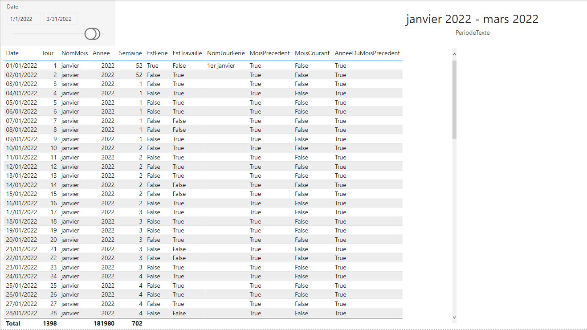

# Summary

In this article, a calandar for data analysis in Power BI will be built, using the Power Query (M) language.
The calandar is built dynamically: each time the dataset is refreshed, the calendar dimension is updated, and based on the current date.

Week numbers are calculated the ISO convetion.

The french holidays are also included, using an open dataset provided the French governement open data initiative.

# ISO Week Number

The ISO week numbers (definition on [Wikipedia](https://en.wikipedia.org/wiki/ISO_week_date#Calculating_the_week_number_of_a_given_date)) are calculated with a function defined in M language (Power Query) and named **GetISOWeekNumber**:

``` powerquery
let
    ISOWeekNumber = (DateToProcess as date) as number =>
  let
    BaseWeekNumber = Number.RoundDown((Date.DayOfYear(DateToProcess) - Date.DayOfWeek(DateToProcess, Day.Monday) + 9) / 7),
    ISOWeekNumber = if BaseWeekNumber = 0
                  then Number.RoundDown((Date.DayOfYear(#date(Date.Year(DateToProcess) - 1, 12, 31)) - Date.DayOfWeek(#date(Date.Year(DateToProcess) - 1, 12, 31), Day.Monday) + 9) / 7)
              else if BaseWeekNumber = 53 and Date.DayOfWeek(#date(Date.Year(DateToProcess), 12, 31), Day.Monday) + 1 < 4
                  then 1
              else BaseWeekNumber
  in
    ISOWeekNumber
in
    ISOWeekNumber
```

> Source : [How to calculate ISO week number in Power Query](https://datacornering.com/how-to-calculate-iso-week-number-in-power-query/)

The ISO code week (concatenation of the ISO year and the ISO week number) is also calculated with a M function and named **GetISOWeekNumberWithYear**:

``` powerquery
let
    ISOWeekNumber = (DateToProcess as date) as text =>
  let
    ISOWeekNumber = GetISOWeekNumber(DateToProcess),
    ISOYear = Date.Year(Date.AddDays(DateToProcess, 26 - ISOWeekNumber)),
    ISOWeekNumberWithYear = Text.From(ISOYear) & " " & WeekAbbrevation & (if ISOWeekNumber < 10 then "0" else "") & Text.From(ISOWeekNumber)
  in
    ISOWeekNumberWithYear
in
    ISOWeekNumber
```

To handle culture, a parameter is required **WeekAbbrevation**, and defined as follow:
It is a list of **text** values:
- W (*week*) for English language,
- S (*semaine*) for French language

> Source : [How to calculate ISO year in Power Query](https://datacornering.com/how-to-calculate-iso-year-in-power-query/)

# Holidays

The French holiday data are retrieved from the following open data [page / service](https://calendrier.api.gouv.fr/jours-feries/).

The holidays are retrieved with a function named **GetHolidays**. The function takes the year as argument (or no argument to retrieve the French holidays from 2000 to 2025).

The function is based on two paramters:
- **GetHolidayUri**, of type text > value: `https://calendrier.api.gouv.fr/jours-feries/`
- **HolidayArea**, of type text > value: `metropole`

**GetHolidays** function definition:

``` powerquery
let
    WorkedDayList = (optional year as number) as table =>
  let
    RelativePathUri = HolidayArea & (if year = null then "" else "/" & Text.From(year)) & ".json",
    Source = Json.Document(Web.Contents(GetHolidayUri,
      [
        RelativePath=RelativePathUri
      ])),
    ConvertToTable = Record.ToTable(Source),
    ChangeType = Table.TransformColumnTypes(ConvertToTable,{{"Name", type date}, {"Value", type text}}),
    RenameColumns = Table.RenameColumns(ChangeType,{{"Name", "HolidayDate"}, {"Value", "HolidayName"}})
  in
    RenameColumns
in
    WorkedDayList
```

# Calendar

To handle culture, a parameter is required **QuarterAbbrevation**, and defined as follow:
It is a list of **text** values:
- Q (*quarter*) for English language,
- T (*trimestre*) for French language

The function **BuildCalendar** is used to generate the calendar. The definition of the function is available below. The following fieds are calculated:
- 

``` powerquery
let
    Calendar = (StartDate as date, EndDate as date, optional Culture as nullable text) as table =>
    let
        DayCount = Duration.Days(Duration.From(EndDate - StartDate)),
        Source = List.Dates(StartDate, DayCount, #duration(1,0,0,0)),
        BuiltTableFromList = Table.FromList(Source, Splitter.SplitByNothing()),
        ChangedType = Table.TransformColumnTypes(BuiltTableFromList,{{"Column1", type date}}),
        RenamedColumns = Table.RenameColumns(ChangedType,{{"Column1", "Date"}}),
        InsertedYear = Table.AddColumn(RenamedColumns, "Year", each Date.Year([Date]), type number),
        InsertedQuarter = Table.AddColumn(InsertedYear, "QuarterOfYear", each Date.QuarterOfYear([Date]), type number),
        InsertedMonth = Table.AddColumn(InsertedQuarter, "MonthOfYear", each Date.Month([Date]), type number),
        InsertedISOWeekNumber = Table.AddColumn(InsertedMonth, "WeekNumber", each GetISOWeekNumber([Date]), type number),
        InsertedDay = Table.AddColumn(InsertedISOWeekNumber, "DayOfMonth", each Date.Day([Date]), type number),
        InsertedDayWeek = Table.AddColumn(InsertedDay, "DayOfWeek", each Date.DayOfWeek([Date], Day.Monday) + 1, type number),
        InsertedQuarterCode = Table.AddColumn(InsertedDayWeek, "QuarterCode",  each Number.ToText([Year]) & " " & QuarterAbbrevation & Number.ToText([QuarterOfYear]), type text),
        InsertedMonthName = Table.AddColumn(InsertedQuarterCode, "MonthName", each Date.ToText([Date], "MMMM", Culture), type text),
        InsertedMonthNameAndCode = Table.AddColumn(InsertedMonthName, "MonthNameAndCode", each (if Text.Length(Text.From(Date.Month([Date]))) = 1 then "0" else "") & Text.From(Date.Month([Date])) & " - " & Date.ToText([Date], "MMMM", Culture), type text),
        InsertedMonthCode = Table.AddColumn(InsertedMonthNameAndCode, "MonthCode", each Text.From([Year] * 100 + [MonthOfYear]), type text),
        InsertedWeekCode = Table.AddColumn(InsertedMonthCode, "WeekCode",  each GetISOWeekNumberWithYear([Date]), type text),
        InsertedDayOfWeekName = Table.AddColumn(InsertedWeekCode, "DayOfWeekName", each Date.ToText([Date], "dddd", Culture), type text),
        InsertedStartOfMonth = Table.AddColumn(InsertedDayOfWeekName, "StartOfMonth",  each Date.StartOfMonth([Date]), type date),
        InsertedEndOfMonth = Table.AddColumn(InsertedStartOfMonth, "EndOfMonth",  each Date.EndOfMonth([Date]), type date),
        InsertedWeekEnding = Table.AddColumn(InsertedEndOfMonth, "WeekEnding", each Date.EndOfWeek([Date]), type date),
        
        BuiltYearsTable = Table.Distinct(Table.Buffer(Table.SelectColumns(InsertedYear, {"Year"}))),
        BuiltBaseHolidaysTable = Table.AddColumn(BuiltYearsTable, "Holidays", each GetHolidays([Year])),
        JoinedHolidaysTable = Table.ExpandTableColumn(BuiltBaseHolidaysTable, "Holidays", {"HolidayDate", "HolidayName"}),
        ChangedHolidayNameType = Table.TransformColumnTypes(JoinedHolidaysTable,{{"HolidayName", type text}}),
        BuiltHolidaysTable = Table.RemoveColumns(ChangedHolidayNameType, {"Year"}),
        InsertedHolidays = Table.Join(InsertedWeekEnding, "Date", BuiltHolidaysTable, "HolidayDate", JoinKind.LeftOuter),
        InsertedIsHoliday = Table.AddColumn(InsertedHolidays, "IsHoliday", each if [HolidayDate] = null then false else true, type logical),
        InsertedIsWorkedDay = Table.AddColumn(InsertedIsHoliday, "IsWorkedDay", each if [IsHoliday] = true or [DayOfWeek] = 5 or [DayOfWeek] = 6  then false else true, type logical),

        InsertedCurrentDate = Table.AddColumn(InsertedIsWorkedDay, "CurrentDate", each DateTime.Date(DateTime.LocalNow()), type date),
        InsertedYearOfPreviousMonth = Table.AddColumn(InsertedCurrentDate, "YearOfPreviousMonth", each if Date.Month([CurrentDate]) = 1 then Date.Year([CurrentDate]) - 1 else Date.Year([CurrentDate]), type number),
        InsertedMonthOfPreviousDay = Table.AddColumn(InsertedYearOfPreviousMonth, "MonthOfPreviousDay", each if Date.Day([CurrentDate]) = 1 then (if Date.Month([CurrentDate]) = 1 then 12 else Date.Month([CurrentDate]) - 1) else Date.Month([CurrentDate]), type number),
        InsertedYearOfPreviousDay = Table.AddColumn(InsertedMonthOfPreviousDay, "YearOfPreviousDay", each if Date.Day([CurrentDate]) = 1 and Date.Month([CurrentDate]) = 1 then Date.Year([CurrentDate]) - 1 else Date.Year([CurrentDate]), type number),
        
        InsertedIsCurrentYear = Table.AddColumn(InsertedYearOfPreviousDay, "IsCurrentYear", each if Date.IsInCurrentYear([Date]) then true else false, type logical),
        InsertedIsCurrentQuarter = Table.AddColumn(InsertedIsCurrentYear, "IsCurrentQuarter", each if Date.IsInCurrentQuarter([Date]) then true else false, type logical),
        InsertedIsCurrentMonth = Table.AddColumn(InsertedIsCurrentQuarter, "IsCurrentMonth", each if Date.IsInCurrentMonth([Date]) then true else false, type logical),
        InsertedIsCurrentWeek = Table.AddColumn(InsertedIsCurrentMonth, "IsCurrentWeek", each if Date.IsInCurrentWeek([Date]) then true else false, type logical),
        InsertedIsCurrentDay = Table.AddColumn(InsertedIsCurrentWeek, "IsCurrentDay", each if Date.IsInCurrentDay([Date]) then true else false, type logical),
        InsertedIsNextYear = Table.AddColumn(InsertedIsCurrentDay, "IsNextYear", each if Date.IsInNextYear([Date]) then true else false, type logical),
        InsertedIsNextQuarter = Table.AddColumn(InsertedIsNextYear, "IsNextQuarter", each if Date.IsInNextQuarter([Date]) then true else false, type logical),
        InsertedIsNextMonth = Table.AddColumn(InsertedIsNextQuarter, "IsNextMonth", each if Date.IsInNextMonth([Date]) then true else false, type logical),
        InsertedIsNextWeek = Table.AddColumn(InsertedIsNextMonth, "IsNextWeek", each if Date.IsInNextWeek([Date]) then true else false, type logical),
        InsertedIsNextDay = Table.AddColumn(InsertedIsNextWeek, "IsNextDay", each if Date.IsInNextDay([Date]) then true else false, type logical),
        InsertedIsPreviousYear = Table.AddColumn(InsertedIsNextDay, "IsPreviousYear", each if Date.IsInPreviousYear([Date]) then true else false, type logical),
        InsertedIsPreviousQuarter = Table.AddColumn(InsertedIsPreviousYear, "IsPreviousQuarter", each if Date.IsInPreviousQuarter([Date]) then true else false, type logical),
        InsertedIsPreviousMonth = Table.AddColumn(InsertedIsPreviousQuarter, "IsPreviousMonth", each if Date.IsInPreviousMonth([Date]) then true else false, type logical),
        InsertedIsPreviousWeek = Table.AddColumn(InsertedIsPreviousMonth, "IsPreviousWeek", each if Date.IsInPreviousWeek([Date]) then true else false, type logical),
        InsertedIsPreviousDay = Table.AddColumn(InsertedIsPreviousWeek, "IsPreviousDay", each if Date.IsInPreviousDay([Date]) then true else false, type logical),
        InsertedIsCurrentOrPreviousYear = Table.AddColumn(InsertedIsPreviousDay, "IsCurrentOrPreviousYear", each if Date.IsInCurrentYear([Date]) or Date.IsInPreviousYear([Date]) then true else false, type logical),
        InsertedIsCurrentOrPreviousMonth = Table.AddColumn(InsertedIsCurrentOrPreviousYear, "IsCurrentOrPreviousMonth", each if Date.IsInCurrentMonth([Date]) or Date.IsInPreviousMonth([Date]) then true else false, type logical),
        InsertedIsYearOfPreviousMonth = Table.AddColumn(InsertedIsCurrentOrPreviousMonth, "IsYearOfPreviousMonth", each if Date.Year([Date]) = [YearOfPreviousMonth] then true else false, type logical),
        InsertedIsMonthOfPreviousDay = Table.AddColumn(InsertedIsYearOfPreviousMonth, "IsMonthOfPreviousDay", each if Date.Year([Date]) = [YearOfPreviousDay] and Date.Month([Date]) = [MonthOfPreviousDay] then true else false, type logical),
    
        RemovedWorkColums = Table.RemoveColumns(InsertedIsMonthOfPreviousDay,{"HolidayDate", "CurrentDate", "YearOfPreviousMonth", "MonthOfPreviousDay", "YearOfPreviousDay"})
    in
        RemovedWorkColums
in
    Calendar
```


## Table Calendar

**YearsToKeep** of type Decimal Number: 5

``` powerquery
let
    Source = BuildCalendar(#date(Date.Year(DateTime.LocalNow()) - YearsToKeep, 1, 1), #date(Date.Year(DateTime.LocalNow()) + 1, 1, 1), "fr"),
    RenamedColumns = Table.RenameColumns(Source,{{"Year", "Annee"}, {"QuarterOfYear", "Trimestre"}, {"MonthOfYear", "Mois"}, {"DayOfMonth", "Jour"}, {"MonthName", "NomMois"}, {"MonthNameAndCode", "NomCodeMois"}, {"DayOfWeekName", "NomJour"},
        {"DayOfWeek", "NumeroJourSemaine"}, {"WeekEnding", "FinSemaine"}, {"MonthCode", "AnneeMois"}, {"QuarterCode", "CodeTrimestre"}, {"StartOfMonth", "DateDebutMois"}, {"EndOfMonth", "DateFinMois"}, {"IsHoliday", "EstFerie"}, {"HolidayName", "NomJourFerie"},
        {"IsWorkedDay", "EstTravaille"}, {"WeekNumber", "Semaine"}, {"WeekCode", "CodeSemaine"}, {"IsCurrentYear", "AnneeCourante"}, {"IsCurrentQuarter", "TrimestreCourant"}, {"IsCurrentMonth", "MoisCourant"}, {"IsCurrentWeek", "SemaineCourante"},
        {"IsCurrentDay", "JourCourant"}, {"IsNextYear", "AnneeSuivante"}, {"IsNextQuarter", "TrimestreSuivant"}, {"IsNextMonth", "MoisSuivant"}, {"IsNextWeek", "SemaineSuivante"}, {"IsNextDay", "JourSuivant"}, {"IsPreviousYear", "AnneePrecedente"},
        {"IsPreviousQuarter", "TrimestrePrecedent"}, {"IsPreviousMonth", "MoisPrecedent"}, {"IsPreviousWeek", "SemainePrecedente"}, {"IsPreviousDay", "JourPrecedent"}, {"IsCurrentOrPreviousYear", "AnneeCouranteOuPrecedente"},
        {"IsCurrentOrPreviousMonth", "MoisCourantOuPrecedent"}, {"IsYearOfPreviousMonth", "AnneeDuMoisPrecedent"}, {"IsMonthOfPreviousDay", "MoisDuJourPrecedent"}}),
    SortedByDate = Table.Buffer(Table.Sort(RenamedColumns,{{"Date", Order.Descending}}))
in
    SortedByDate
```

# Quick measures (DAX) to display the selected date

## Year-Month text

The **AnneeMoisTexte** measure displays the name of the month and the year (the beginning of the selected period).

 ``` DAX
CALCULATE(MIN(Calendrier[NomMois]) & " " & MIN(Calendrier[Annee]))
```

## Past Year-Month text

The **AnneeMoisRevoluTexte** measure displays the name of the month and the year of the past month.

 ``` DAX
CALCULATE(MIN(Calendrier[NomMois]) & " " & MIN(Calendrier[Annee]), FILTER(Calendrier, Calendrier[Date] < DATE(YEAR(TODAY()), MONTH(TODAY()), 1)))
```

### Period text

The **PeriodeTexte** measure displays the name of the month and the year of the beginning of the selected period and the name of the month and the year of the end of the selected period.

 ``` DAX
var minDate = MIN(Calendrier[Date])
var maxDate = MAX(Calendrier[Date])

var minDateText = CALCULATE(MIN(Calendrier[NomMois]) & " " & MIN(Calendrier[Annee]), FILTER(ALL(Calendrier), Calendrier[Date] = minDate))
var maxDateText = CALCULATE(MIN(Calendrier[NomMois]) & " " & MIN(Calendrier[Annee]) , FILTER(ALL(Calendrier), Calendrier[Date] = maxDate))

return minDateText & " - " & maxDateText
```




The file ***DateDimensionWithFrenchHolidays.pbix*** contains the solution.